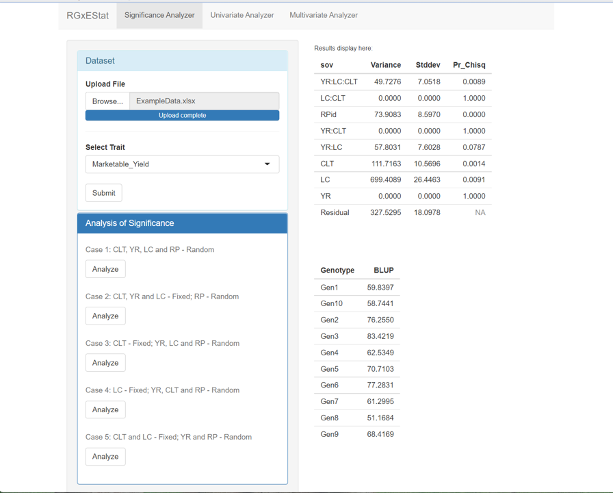

# RGxEStat

**Interactive Genotype × Environment Statistical Analysis**

RGxEStat is an R/Shiny package, providing a user-friendly web interface for performing:

-   **Analysis of Significance** based on mixed effect model
-   **Univariate Stability Analysis** including group regression slope and deviation, Shukla's σ², Wricke's ecovalence, Kang's yield stability, etc.
-   **Multivariate Stability Analysis** by analysis of variance, principal component analysis, and singular value decomposition.
-   **Export** of tables and figures

------------------------------------------------------------------------

## 📦 Installation

Install the released version from CRAN:

``` r
install.packages("RGxEStat")
```

or from GitHub:

``` r
devtools::install_github("mason-ching/RGxEStat@main")
```

------------------------------------------------------------------------

## 🚀 Launching the App

``` r
library(RGxEStat)
run_app()
```

This will open an interactive app in your browser with three main tabs:

1.  **Significance Analyzer**
2.  **Univariate Analyzer**
3.  **Multivariate Analyzer**

------------------------------------------------------------------------

## 🔍 1. Significance Analyzer

Select your dataset and trait, then choose one of five different cases to perform ANOSI:

-   Fixed/Random effect combinations of Genotype (CLT), Year (YR), Location (LC) and Replication (RP).

Results include the ANOSI tables of random and fixed effects and BLUP estimates for each genotype.



------------------------------------------------------------------------

## 📈 2. Univariate Analyzer

### 2.1 Descriptive and stability statistics for each genotype:

-   **Coefficient of Variation**
-   **Trait Means over various factors**
-   **Group Regression Slope and Deviation**
-   **Shukla's σ², Wricke's Ecovalence, Kang's Yield Stability**

Click **Execute** or **Compute** under each section to update the results table on the right.

### 2.2 Discriminative and representative location & environment

-   **Location**: genotype F ratio for each location and correlation among location and average location
-   **Environment**: genotype F ratio for each environment and correlation among environment and average environment

When the mean of all genotypes are equal, then the F ratio will be close to 1. If analysis of variance is run by location, then high genotype F ratio indicates high discriminating ability for that location. High and significant Pearson correlation of each location with the mean of all locations indicates strong representation of mean location performance.


### 2.3 Cluster analysis & Export results

-   **Cluster dendrogram** groups similar locations
-   **Save & Export** panel:
    -   Choose which results to export
    -   Select file format: `csv`, `txt`, `xlsx`, `doc`
    -   Click **Export** to download


------------------------------------------------------------------------

## 📊 3. Multivariate Analyzer

### 3.1 Additive main effect and multiplicative interaction


-   Select principal components (PC1, PC2, PC3, PC4) and render a biplot or triplot

### 3.2 Gene main effect plus gene-environment interaction effect


-   Interactive window for model selection and various biplot explorations


------------------------------------------------------------------------

## ⚙️ API

If you prefer to integrate RGxEStat into your own scripts, you can call:

``` r
# Launch the interactive app
RGxEStat::run_app()
```

------------------------------------------------------------------------

## 📝 NEWS

See [NEWS.md](NEWS.md) for the full changelog.

------------------------------------------------------------------------

## 🖥️ Standalone Application

The RGxEStat has been packaged as a standalone desktop application using Electron. You **do not** need to install R or any R packages to run it. Just simply download the release from: [Google Drive](https://drive.google.com/file/d/1AvK8B6NXodgGHv2K6t7tHX0olEem_3n_/view?usp=sharing), unzip it, and double-click `RGxEStat.exe` to launch the application.

**Note:** 
-   Currently, only Windows systems are supported. For any questions or issues, feel free to contact [mengenching\@gmail.com](mailto:mengenching@gmail.com).
-   Use YR, LC, CLT and RP as the column names of years, locations, cultivars(genotypes) and replications in your data file.

------------------------------------------------------------------------

## 📄 License

The project and application are licensed under the [MIT License](LICENSE) and developed as part of my undergraduate thesis work at Henan University.
